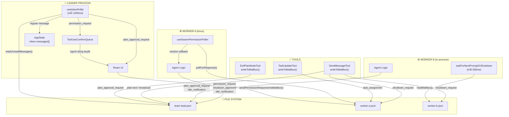
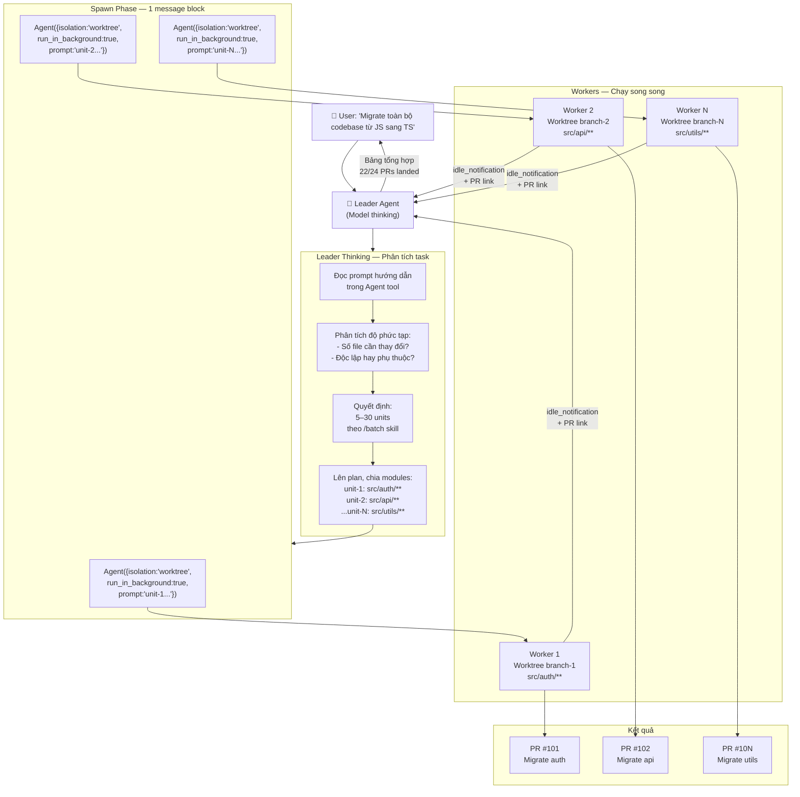

# Claude Code — Kiến Trúc Điều Phối Đa Agents

> **Dành cho:** Trình bày nội bộ · Cấp quản lý & các bên liên quan
> **Mức độ kỹ thuật:** Tổng quan — không yêu cầu nền tảng lập trình

---

## Mục Lục

1. [Bức Tranh Toàn Cảnh](#1-bức-tranh-toàn-cảnh)
2. [Các Thành Phần Chính](#2-các-thành-phần-chính)
3. [Hành Trình Từ Yêu Cầu Đến Kết Quả](#3-hành-trình-từ-yêu-cầu-đến-kết-quả)
4. [Hai Mô Hình Làm Việc](#4-hai-mô-hình-làm-việc)
5. [Cơ Chế Tư Duy (Thinking)](#5-cơ-chế-tư-duy-thinking)
6. [Bảo Mật & Kiểm Soát Quyền](#6-bảo-mật--kiểm-soát-quyền)
7. [Cơ Chế Mailbox — Hệ Thống Hộp Thư Nội Bộ](#7-cơ-chế-mailbox--hệ-thống-hộp-thư-nội-bộ)
8. [Tạo Agent Động — Leader Thinking & Phân Chia Công Việc](#8-tạo-agent-động--leader-thinking--phân-chia-công-việc)
9. [Tóm Tắt Giá Trị Cốt Lõi](#9-tóm-tắt-giá-trị-cốt-lõi)

---

## 1. Bức Tranh Toàn Cảnh

Hãy tưởng tượng Claude Code như một **công ty thu nhỏ** vận hành tự động:

```
┌─────────────────────────────────────────────────────────────────┐
│                        NGƯỜI DÙNG                               │
│              "Hãy xây cho tôi tính năng X"                      │
└───────────────────────────┬─────────────────────────────────────┘
                            │  Giao nhiệm vụ
                            ▼
┌─────────────────────────────────────────────────────────────────┐
│                    AGENT TRƯỞNG (Leader)                        │
│           Tiếp nhận · Phân tích · Điều phối                     │
└──────────┬──────────────────────────────────┬───────────────────┘
           │ Giao việc                         │ Giao việc
           ▼                                   ▼
┌─────────────────────┐             ┌─────────────────────┐
│   AGENT CON A       │             │   AGENT CON B       │
│  (Sub-agent)        │             │  (Sub-agent)        │
│  Nghiên cứu code    │             │  Viết tài liệu      │
└─────────────────────┘             └─────────────────────┘
           │                                   │
           └──────────────┬────────────────────┘
                          │ Kết quả tổng hợp
                          ▼
┌─────────────────────────────────────────────────────────────────┐
│                    NGƯỜI DÙNG NHẬN KẾT QUẢ                      │
└─────────────────────────────────────────────────────────────────┘
```

**Điểm mấu chốt:** Claude Code không làm việc một mình. Nó có thể **tạo ra một đội ngũ agents**, mỗi người chuyên một việc, phối hợp song song — giống như một người quản lý dự án điều phối nhiều chuyên gia.

---

## 2. Các Thành Phần Chính

### 2.1 Agent Trưởng (Leader Agent)

```
┌──────────────────────────────────────────────────────┐
│                  AGENT TRƯỞNG                        │
│                                                      │
│  • Nhận yêu cầu từ người dùng                       │
│  • Phân tích và lên kế hoạch                         │
│  • Quyết định: tự làm hay giao cho agent con?        │
│  • Tổng hợp kết quả cuối cùng                        │
│  • Báo cáo về cho người dùng                         │
└──────────────────────────────────────────────────────┘
```

> **Ví dụ thực tế:** Bạn yêu cầu *"Refactor toàn bộ module thanh toán"*. Agent trưởng sẽ đọc yêu cầu, chia nhỏ thành: *(1) phân tích code hiện tại, (2) viết code mới, (3) viết test, (4) cập nhật tài liệu* — rồi giao cho các agents chuyên biệt.

---

### 2.2 Agent Con (Sub-Agent)

```
┌──────────────────────────────────────────────────────┐
│                    AGENT CON                         │
│                                                      │
│  • Nhận một nhiệm vụ cụ thể, rõ ràng                │
│  • Làm việc trong môi trường cô lập                  │
│  • Chỉ có quyền dùng các công cụ được phép           │
│  • Gửi kết quả về cho Agent trưởng                   │
└──────────────────────────────────────────────────────┘
```

Mỗi agent con được trang bị **bộ công cụ riêng** phù hợp với nhiệm vụ:

| Loại Agent | Chuyên làm gì | Công cụ điển hình |
|---|---|---|
| `general-purpose` | Làm mọi việc đa năng | Đọc/viết file, chạy lệnh, tìm kiếm |
| `explore` | Khám phá & nghiên cứu code | Tìm kiếm, đọc file (không sửa) |
| `plan` | Lên kế hoạch kiến trúc | Phân tích, đề xuất (không thực thi) |
| `claude-code-guide` | Hỗ trợ hướng dẫn người dùng | Tra cứu tài liệu |
| *(tùy chỉnh)* | Theo nhu cầu doanh nghiệp | Do người dùng cấu hình |

---

### 2.3 Teammate (Đồng Đội Song Song)

Khác với Agent con chạy tuần tự, **Teammates** là các agents hoạt động **đồng thời và độc lập**, giống như nhiều nhân viên cùng làm việc một lúc:

```
┌─────────────────────────────────────────────────────────────┐
│                     TEAM PROJECT X                          │
│                                                             │
│   Agent Trưởng ─────────────────────────────────────────   │
│        │              │               │                     │
│        ▼              ▼               ▼                     │
│  ┌──────────┐  ┌──────────┐  ┌──────────┐                  │
│  │Teammate A│  │Teammate B│  │Teammate C│                   │
│  │ Frontend │  │ Backend  │  │ Testing  │                   │
│  │ (đang    │  │ (đang    │  │ (đang    │                   │
│  │  chạy)  │  │  chạy)  │  │  chạy)  │                   │
│  └──────────┘  └──────────┘  └──────────┘                  │
│                                                             │
│   ← Tất cả chạy song song cùng một lúc →                   │
└─────────────────────────────────────────────────────────────┘
```

---

### 2.4 Hộp Thư (Mailbox)

Đây là **kênh liên lạc** giữa các agents — không khác gì hòm thư email nội bộ:

```
┌────────────┐    gửi tin nhắn    ┌─────────────────────────┐
│ Teammate A │ ─────────────────► │  Hộp thư của Teammate B │
└────────────┘                    └────────────┬────────────┘
                                               │  nhận & đọc
                                               ▼
                                        ┌────────────┐
                                        │ Teammate B │
                                        │ (trả lời)  │
                                        └────────────┘
```

> Agents giao tiếp thông qua công cụ **SendMessage** — gửi cả tin nhắn thường lẫn các lệnh đặc biệt như *"yêu cầu phê duyệt"* hay *"thông báo hoàn thành"*.

---

### 2.5 Bộ Lọc Công Cụ (Tool Filter)

Một cơ chế kiểm soát quan trọng — mỗi agent **chỉ được làm những việc phù hợp với vai trò**:

```
  Kho công cụ đầy đủ của hệ thống
  ┌─────────────────────────────────┐
  │ Đọc file  Viết file  Chạy lệnh │
  │ Tìm kiếm  Gửi tin   Tạo agent  │
  │ Kết nối DB  Gọi API  ...       │
  └──────────────┬──────────────────┘
                 │
                 ▼  Bộ lọc áp dụng
  ┌──────────────────────────────────┐
  │ Agent "Explore" chỉ được:        │
  │   ✅ Đọc file                    │
  │   ✅ Tìm kiếm                    │
  │   ❌ Viết/sửa file               │
  │   ❌ Chạy lệnh hệ thống          │
  └──────────────────────────────────┘
```

---

## 3. Hành Trình Từ Yêu Cầu Đến Kết Quả

Dưới đây là toàn bộ luồng xử lý — từ khi người dùng gõ yêu cầu đến khi nhận được kết quả:

```
BƯỚC 1 — TIẾP NHẬN
═══════════════════
  👤 Người dùng
     │
     │  "Hãy phân tích và cải thiện hiệu năng ứng dụng"
     ▼
  🧠 Agent Trưởng nhận yêu cầu


BƯỚC 2 — PHÂN TÍCH & LÊN KẾ HOẠCH
════════════════════════════════════
  🧠 Agent Trưởng
     │
     │  Đọc yêu cầu → Hiểu ngữ cảnh → Lên kế hoạch
     │
     ├─── Việc 1: Phân tích code hiện tại   → Agent Explore
     ├─── Việc 2: Đo điểm nghẽn hiệu năng  → Agent General
     ├─── Việc 3: Đề xuất giải pháp        → Agent Plan
     └─── Việc 4: Thực hiện cải thiện      → Agent General


BƯỚC 3 — CHUẨN BỊ & KHỞI ĐỘNG AGENT
══════════════════════════════════════
  🔧 Hệ thống chuẩn bị cho từng agent:
     │
     ├─ Chọn đúng loại agent phù hợp
     ├─ Cấp phát công cụ theo vai trò (Bộ lọc công cụ)
     ├─ Tạo môi trường làm việc riêng biệt (Cô lập)
     ├─ Truyền cấu hình tư duy (Thinking Config)
     └─ Khởi động agent


BƯỚC 4 — THỰC THI SONG SONG
═════════════════════════════
  ⚡ Các agents làm việc cùng lúc:

  Agent Explore          Agent Plan           Agent General
      │                      │                    │
   Đọc code              Phân tích            Đo hiệu năng
      │                      │                    │
   Tìm điểm              Lên phương án        Ghi kết quả
   yếu                       │                    │
      │                  Gửi đề xuất          Gửi số liệu
      └──────────────────────┴────────────────────┘
                             │
                     Gửi kết quả về Hộp thư


BƯỚC 5 — TỔNG HỢP
═══════════════════
  🧠 Agent Trưởng
     │
     ├─ Thu thập kết quả từ tất cả agents
     ├─ Kiểm tra tính nhất quán
     ├─ Tổng hợp thành câu trả lời hoàn chỉnh
     └─ Ghi nhận số liệu (token, thời gian, ...)


BƯỚC 6 — TRẢ KẾT QUẢ
══════════════════════
     │
     ▼
  👤 Người dùng nhận kết quả đầy đủ
```

---

## 4. Hai Mô Hình Làm Việc

### Mô Hình A — Đồng Bộ (Chờ Kết Quả)

Phù hợp cho tác vụ ngắn, cần kết quả ngay:

```
Người dùng
    │  yêu cầu
    ▼
Agent Trưởng
    │  tạo agent con
    ▼
Agent Con ──── làm việc ────► kết quả
    │
    ▼
Agent Trưởng tổng hợp
    │
    ▼
Người dùng nhận kết quả
    ⏱️ Chờ trong suốt quá trình
```

---

### Mô Hình B — Bất Đồng Bộ (Chạy Nền)

Phù hợp cho tác vụ lớn, mất nhiều thời gian:

```
Người dùng
    │  yêu cầu + "chạy nền"
    ▼
Agent Trưởng
    │  tạo agent nền
    ▼
Agent Nền ─────────────────────────────► kết quả (sau vài phút)
    │                                         │
    ▼                                         │
Người dùng được thông báo ngay:              │
  "Đã khởi động! ID: abc-123"                │
  → Tiếp tục làm việc khác                   │
                              ◄──────────────┘
                    Thông báo: "Hoàn thành!"
```

> **Lợi ích:** Người dùng không cần ngồi chờ — hệ thống báo khi xong việc.

---

## 5. Cơ Chế Tư Duy (Thinking)

Một trong những điểm đặc biệt của Claude Code là khả năng **kiểm soát mức độ "suy nghĩ sâu"** của từng agent:

```
┌──────────────────────────────────────────────────────────────┐
│                   CÁC CHẾ ĐỘ TƯ DUY                         │
│                                                              │
│  🟢 ADAPTIVE (Tự động)                                       │
│     Model tự quyết định khi nào cần suy nghĩ sâu            │
│     → Phù hợp cho hầu hết tác vụ thông thường               │
│                                                              │
│  🔵 ENABLED (Bật có giới hạn)                                │
│     Suy nghĩ sâu với ngân sách token xác định               │
│     → Phù hợp cho vấn đề phức tạp, cần độ chính xác cao    │
│                                                              │
│  ⚫ DISABLED (Tắt)                                           │
│     Trả lời nhanh, không suy nghĩ thêm                      │
│     → Phù hợp cho câu hỏi đơn giản, cần tốc độ             │
└──────────────────────────────────────────────────────────────┘
```

### Thinking được truyền như thế nào?

```
Agent Trưởng
  │  cấu hình thinking (ví dụ: ADAPTIVE)
  │
  ├──► Agent Con A  (kế thừa: ADAPTIVE)
  ├──► Agent Con B  (kế thừa: ADAPTIVE)
  └──► Fork Agent   (luôn tắt thinking-out-loud
                     để tối ưu tốc độ và cache)
```

> **Lưu ý quan trọng:** Các agents loại "Fork" (chạy song song từ cùng một gốc) được chỉ định **không được nói to suy nghĩ** — chỉ trả kết quả trực tiếp — nhằm tăng tốc độ và tiết kiệm tài nguyên.

### Ultrathink — Chế Độ Suy Nghĩ Cực Sâu

```
Người dùng gõ: "ultrathink về vấn đề này..."
                        │
                        ▼
           Hệ thống nhận ra từ khóa
                        │
                        ▼
         Mở rộng ngân sách token tối đa
                        │
                        ▼
      Claude suy nghĩ rất sâu trước khi trả lời
```

---

## 6. Bảo Mật & Kiểm Soát Quyền

### Nguyên Tắc Cô Lập

Mỗi agent hoạt động trong **vùng làm việc riêng biệt** — không thể vô tình ảnh hưởng đến nhau:

```
┌─────────────────────────────────────────────────────────┐
│                    HỆ THỐNG CHÍNH                       │
│                                                         │
│  ┌─────────────────┐     ┌─────────────────┐            │
│  │  Môi trường     │     │  Môi trường     │            │
│  │  Agent A        │     │  Agent B        │            │
│  │                 │     │                 │            │
│  │  • File state   │     │  • File state   │            │
│  │    riêng        │     │    riêng        │            │
│  │  • Bộ nhớ       │     │  • Bộ nhớ       │            │
│  │    riêng        │     │    riêng        │            │
│  │  • Nút hủy      │     │  • Nút hủy      │            │
│  │    riêng        │     │    riêng        │            │
│  └─────────────────┘     └─────────────────┘            │
│                                                         │
│  Nếu Agent Trưởng bị hủy → Tất cả agents con cũng hủy  │
└─────────────────────────────────────────────────────────┘
```

### Các Cấp Độ Kiểm Soát

```
CẤP 1 — CÔNG CỤ BỊ CẤM TUYỆT ĐỐI
  Không agent nào được dùng, bất kể loại gì.
  Ví dụ: công cụ có thể phá vỡ cô lập hệ thống

CẤP 2 — CÔNG CỤ CHỈ DÀNH CHO AGENT TÍCH HỢP SẴN
  Agent tùy chỉnh của người dùng không thể dùng.
  Ví dụ: một số công cụ hệ thống nhạy cảm

CẤP 3 — CÔNG CỤ DÀNH CHO AGENT CHẠY NỀN
  Chỉ một tập hạn chế, không có tác dụng phụ rủi ro

CẤP 4 — MCP TOOLS (luôn được phép)
  Các công cụ bên ngoài kết nối qua giao thức MCP
  → Được cho phép với tất cả agent loại
```

### Worktree — Môi Trường Làm Việc Cô Lập

```
  Kho code gốc
       │
       │  tạo bản sao tạm thời
       ▼
  Worktree (bản sao)
       │
  Agent làm việc trên bản sao
       │
  ┌────┴────┐
  │ Có thay │  → Merge vào gốc sau khi xem xét
  │  đổi?   │
  └────┬────┘
  │Không có │  → Xóa worktree, không để lại dấu vết
  └─────────┘
```

---

## 7. Cơ Chế Mailbox — Hệ Thống Hộp Thư Nội Bộ

Mailbox là **xương sống giao tiếp** của toàn bộ hệ thống đa-agent. Không có Mailbox, các agents không thể nói chuyện với nhau. Hệ thống có **hai lớp** hoàn toàn tách biệt, mỗi lớp phục vụ một mục đích khác nhau.

---

### 7.1 Hai Lớp Mailbox

```
┌─────────────────────────────────────────────────────────────────────┐
│                      HỆ THỐNG MAILBOX                               │
│                                                                     │
│  LỚP 1 — IN-MEMORY MAILBOX                                          │
│  src/utils/mailbox.ts + src/context/mailbox.tsx                     │
│  ─────────────────────────────────────────────────────────────────  │
│  class Mailbox {                                                     │
│    queue: Message[]    ← hàng đợi tin chưa được đọc                │
│    waiters: Waiter[]   ← danh sách "người đang chờ" tin            │
│  }                                                                   │
│                                                                     │
│  ✅ Dùng cho giao tiếp nội bộ trong cùng React process             │
│  ✅ Tốc độ cao — không đọc/ghi đĩa                                  │
│  ✅ Notify ngay lập tức qua signal                                   │
│  ❌ Mất khi process tắt                                              │
│  ❌ Không liên lạc được với process khác (tmux)                     │
│                                                                     │
├─────────────────────────────────────────────────────────────────────┤
│  LỚP 2 — FILE-BASED MAILBOX (Cross-Process)                         │
│  src/utils/teammateMailbox.ts                                       │
│  ─────────────────────────────────────────────────────────────────  │
│  ~/.claude/teams/{team_name}/inboxes/{agent_name}.json             │
│                                                                     │
│  ✅ Dùng cho giao tiếp giữa các process riêng biệt (tmux)          │
│  ✅ Persistent — tồn tại qua restart                                │
│  ✅ An toàn đồng thời — dùng file lock để tránh race condition      │
│  ❌ Chậm hơn — cần I/O đĩa                                          │
│  ❌ Cần polling định kỳ để phát hiện tin mới                        │
└─────────────────────────────────────────────────────────────────────┘
```

---

### 7.2 Lớp 1 — In-Memory Mailbox: Cơ Chế Bên Trong

> **Source:** [`src/utils/mailbox.ts`](src/utils/mailbox.ts) (73 dòng)

```
class Mailbox {
  queue: Message[]      // Tin đã gửi nhưng chưa ai nhận
  waiters: Waiter[]     // Người đang Promise.resolve() chờ tin
  _revision: number     // Đếm số lần thay đổi (để React biết re-render)
}
```

**Cách `send()` hoạt động — ưu tiên waiter trước queue:**

```
mailbox.send(msg)
    │
    ├─ Có waiter nào đang chờ msg này không? (fn(msg) === true)
    │      │
    │      ├─ CÓ → resolve Promise của waiter ngay lập tức
    │      │        waiter không cần vào queue
    │      │        → thông báo React re-render
    │      │
    │      └─ KHÔNG → đẩy msg vào queue[]
    │                  → thông báo React re-render
    │
    └─ (xong)
```

**Cách `receive()` hoạt động — async, có thể chờ:**

```
mailbox.receive(filterFn)
    │
    ├─ Có msg nào trong queue thỏa filterFn không?
    │      │
    │      ├─ CÓ → lấy ra ngay, return Promise.resolve(msg)
    │      │
    │      └─ KHÔNG → đăng ký vào waiters[]
    │                  return Promise (chưa resolve)
    │                  → chờ đến khi send() gọi resolve()
    │
    └─ (chờ...)
```

**Cách `poll()` hoạt động — đồng bộ, không chờ:**

```
mailbox.poll(filterFn)
    │
    ├─ Có msg nào trong queue thỏa filterFn?
    │      ├─ CÓ → lấy ra, trả về msg
    │      └─ KHÔNG → trả về undefined (không chờ)
    │
    └─ (xong ngay lập tức)
```

**React Context Wrapper** ([`src/context/mailbox.tsx`](src/context/mailbox.tsx)):
```
MailboxProvider
  └─ tạo 1 instance Mailbox duy nhất (useMemo, singleton)
  └─ cung cấp qua React Context
       └─ useMailboxBridge() poll() → khi có tin → onSubmitMessage()
```

---

### 7.3 Lớp 2 — File-Based Mailbox: Cấu Trúc Lưu Trữ

> **Source:** [`src/utils/teammateMailbox.ts`](src/utils/teammateMailbox.ts) (1,183 dòng)

**Mỗi agent có một file inbox riêng:**

```
~/.claude/
└── teams/
    └── {team_name}/
        ├── config.json              ← thông tin team & members
        └── inboxes/
            ├── team-lead.json       ← inbox của leader
            ├── researcher.json      ← inbox của teammate A
            ├── frontend-dev.json    ← inbox của teammate B
            └── tester.json          ← inbox của teammate C
```

**Cấu trúc mỗi file inbox (JSON array):**

```json
[
  {
    "from": "team-lead",
    "text": "Hãy phân tích module thanh toán",
    "timestamp": "2026-04-07T10:00:00.000Z",
    "read": true,
    "color": "blue",
    "summary": "Phân tích module thanh toán"
  },
  {
    "from": "researcher",
    "text": "{\"type\":\"permission_request\", \"request_id\":\"abc\", ...}",
    "timestamp": "2026-04-07T10:01:00.000Z",
    "read": false,
    "color": "green",
    "summary": "Xin phép dùng Bash tool"
  }
]
```

> **Chú ý quan trọng:** Trường `text` có thể là plain text **hoặc** JSON string chứa tin nhắn hệ thống (structured protocol message). Poller phải parse JSON để phân loại.

---

### 7.4 Luồng Ghi Tin (writeToMailbox) — Có File Lock

> **Source:** [`src/utils/teammateMailbox.ts`](src/utils/teammateMailbox.ts) dòng 134–192

```
Agent A muốn gửi tin cho Agent B
        │
        ▼
writeToMailbox("B", { from:"A", text:"...", timestamp:"..." })
        │
        ├─ 1. Đảm bảo thư mục inboxes/ tồn tại (mkdir -p)
        │
        ├─ 2. Tạo file B.json nếu chưa có (flag:'wx' → không ghi đè)
        │
        ├─ 3. Lấy FILE LOCK (lockfile.lock)
        │      ├─ Nếu file đang bị lock → CHỜ (retry tối đa 10 lần)
        │      │   minTimeout: 5ms, maxTimeout: 100ms
        │      └─ Lấy được lock → tiếp tục
        │
        ├─ 4. Đọc lại toàn bộ messages từ file (đọc lại SAU KHI có lock
        │      để không bỏ sót tin nhắn của agent khác vừa ghi)
        │
        ├─ 5. Append message mới: messages.push({ ...msg, read: false })
        │
        ├─ 6. Ghi toàn bộ array trở lại file (JSON, 2 spaces indent)
        │
        └─ 7. RELEASE file lock
```

**Tại sao cần file lock?** Vì nhiều agents có thể cùng lúc gửi tin cho cùng một người:

```
Agent A: writeToMailbox("leader") ─┐
Agent B: writeToMailbox("leader") ─┤─ Không có lock → race condition
Agent C: writeToMailbox("leader") ─┘   → mất tin nhắn!

Agent A: writeToMailbox("leader") ─┐
Agent B: writeToMailbox("leader") ─┤─ Có lock → tuần tự, an toàn
Agent C: writeToMailbox("leader") ─┘   → không mất tin nào
```

---

### 7.5 Luồng Đọc Tin — Hai Cơ Chế Polling Song Song

Tùy vào loại agent, cơ chế polling khác nhau:

```
┌──────────────────────────────────────────────────────────────────┐
│                    AI ĐANG POLLING?                              │
│                                                                  │
│  Process-based teammates (tmux/iTerm2)                           │
│  + Team Leader                                                   │
│  → useInboxPoller hook (React)                                   │
│    poll mỗi 1000ms (INBOX_POLL_INTERVAL_MS)                      │
│    src/hooks/useInboxPoller.ts                                   │
│                                                                  │
│  In-process teammates (chạy trong cùng process)                  │
│  → waitForNextPromptOrShutdown() loop                            │
│    poll mỗi 500ms                                                │
│    src/utils/swarm/inProcessRunner.ts                            │
└──────────────────────────────────────────────────────────────────┘
```

**useInboxPoller — Luồng xử lý mỗi 1000ms:**

> **Source:** [`src/hooks/useInboxPoller.ts`](src/hooks/useInboxPoller.ts) dòng 126–300

```
Mỗi 1000ms:
    │
    ▼
readUnreadMessages(agentName, teamName)
    │
    ├─ Không có tin mới → return (chờ đến lần sau)
    │
    └─ Có tin mới → phân loại từng tin:
          │
          ├─ permission_request      → route đến ToolUseConfirmQueue (leader UI)
          ├─ permission_response     → resolve callback của worker
          ├─ sandbox_permission_req  → route đến sandbox handler
          ├─ sandbox_permission_resp → resolve sandbox callback
          ├─ shutdown_request        → trigger shutdown flow
          ├─ shutdown_approved       → xác nhận agent đã dừng
          ├─ team_permission_update  → cập nhật quyền cho tất cả teammates
          ├─ mode_set_request        → đổi permission mode (plan/auto/...)
          ├─ plan_approval_request   → hiển thị plan để leader duyệt
          └─ (regular text)          → submit vào LLM context như turn mới
               │
               ├─ Agent đang idle → submit ngay lập tức
               └─ Agent đang bận → xếp vào AppState.inbox.messages[]
                                    (deliver sau khi turn hiện tại xong)
```

**waitForNextPromptOrShutdown — Thứ tự ưu tiên đọc tin:**

> **Source:** [`src/utils/swarm/inProcessRunner.ts`](src/utils/swarm/inProcessRunner.ts) dòng 760–861

```
Mỗi 500ms (in-process teammate):
    │
    ▼
Đọc toàn bộ messages từ file inbox
    │
    ├─ BƯỚC 1: Quét tìm shutdown_request (ƯU TIÊN CAO NHẤT)
    │   └─ Tìm thấy → mark as read → return {type:'shutdown_request'}
    │                  (bỏ qua mọi tin khác dù quan trọng)
    │
    ├─ BƯỚC 2: Tìm tin từ team-lead (ƯU TIÊN CAO)
    │   └─ Tìm thấy → mark as read → return {type:'new_message'}
    │
    ├─ BƯỚC 3: Tin đầu tiên chưa đọc (FIFO, bất kỳ ai gửi)
    │   └─ Tìm thấy → mark as read → return {type:'new_message'}
    │
    └─ BƯỚC 4: Không có tin → kiểm tra task list
        └─ Có task chưa được nhận → claim task → return {type:'new_message'}
```

> **Tại sao shutdown được ưu tiên cao nhất?** Để tránh tình huống leader flood inbox với nhiều tin, khiến shutdown request bị "chôn" phía sau và agent không thể dừng kịp thời.
>
> **Tại sao tin từ team-lead được ưu tiên hơn peer?** Leader đại diện cho ý định người dùng và điều phối toàn bộ team. Tin từ peer (agent khác) không được làm "đói" tin từ leader.

---

### 7.6 Các Loại Tin Nhắn Hệ Thống (Structured Protocol Messages)

> **Source:** [`src/utils/teammateMailbox.ts`](src/utils/teammateMailbox.ts) dòng 1073–1095

Tất cả 10 loại tin nhắn đặc biệt đều được serialize thành JSON string trong trường `text`. Hàm `isStructuredProtocolMessage()` kiểm tra trước khi route:

```
┌────────────────────────────────────────────────────────────────────┐
│                  BẢNG PHÂN LOẠI TIN NHẮN HỆ THỐNG                 │
│                                                                    │
│  Loại tin                   Từ → Đến       Ý nghĩa                │
│  ─────────────────────────────────────────────────────────────     │
│  permission_request         Worker → Leader  Xin phép dùng tool   │
│  permission_response        Leader → Worker  Trả lời xin phép     │
│  sandbox_permission_request Worker → Leader  Xin phép network     │
│  sandbox_permission_response Leader → Worker Trả lời network      │
│  shutdown_request           Leader → Worker  Yêu cầu dừng lại     │
│  shutdown_approved          Worker → Leader  Đồng ý dừng          │
│  shutdown_rejected          Worker → Leader  Từ chối dừng         │
│  plan_approval_request      Worker → Leader  Xin duyệt kế hoạch   │
│  plan_approval_response     Leader → Worker  Duyệt/từ chối plan   │
│  team_permission_update     Leader → All     Cập nhật quyền chung │
│  mode_set_request           Leader → Worker  Đổi permission mode  │
│  idle_notification          Worker → Leader  Báo đang rảnh        │
│  task_assignment            Leader → Worker  Giao task mới        │
└────────────────────────────────────────────────────────────────────┘
```

---

### 7.7 Luồng Chi Tiết: Permission Request (Xin Phép Dùng Tool)

Đây là một trong những luồng phức tạp nhất — worker xin phép, leader quyết định, kết quả trả về worker:

```
WORKER (tmux process)                    LEADER (UI process)
─────────────────────                    ──────────────────

1. Muốn chạy Bash("rm -rf")
   │
2. hasPermissionsToUseTool() → "ask"
   │
3. Tạo permission_request message:
   { type: "permission_request",
     request_id: "req-123",
     tool_name: "Bash",
     input: { command: "rm -rf" },
     description: "Xóa thư mục cũ" }
   │
4. writeToMailbox("team-lead", msg)
   ──────────────────────────────────►
                                        5. useInboxPoller phát hiện
                                           permission_request
                                           │
                                        6. Route đến ToolUseConfirmQueue
                                           │
                                        7. Leader UI hiển thị:
                                           "Worker xin phép chạy Bash"
                                           [Cho phép] [Từ chối]
                                           │
                                        8. Người dùng click [Cho phép]
                                           │
                                        9. sendPermissionResponseViaMailbox(
                                             "worker", { decision:"allowed" })
                                           │
                                        10. writeToMailbox("worker", response)
   ◄──────────────────────────────────
11. useSwarmPermissionPoller phát hiện
    permission_response với request_id="req-123"
    │
12. resolve callback → tool được phép chạy
    │
13. Bash("rm -rf") thực thi
```

---

### 7.8 Luồng Chi Tiết: Shutdown Flow (Dừng Agent)

```
LEADER                                   WORKER
──────                                   ──────

1. Người dùng/leader muốn dừng worker
   │
2. sendShutdownRequestToMailbox("worker-A")
   │  Tạo: { type:"shutdown_request",
   │          requestId:"shutdown-workerA-xyz",
   │          from:"team-lead" }
   │
3. writeToMailbox("worker-A", msg)
   ──────────────────────────────────►
                                        4. waitForNextPromptOrShutdown()
                                           phát hiện shutdown_request
                                           (ƯU TIÊN CAO NHẤT)
                                           │
                                        5. Model quyết định: đồng ý hay từ chối?
                                           │
                                        6a. Đồng ý:
                                            createShutdownApprovedMessage()
                                            writeToMailbox("team-lead", approved)
   ◄──────────────────────────────────
                                            │
                                            abortController.abort()
                                            ← Agent dừng hoạt động

7. Leader nhận shutdown_approved
   │
8a. In-process: task.abortController.abort()
8b. Out-of-process: gracefulShutdown() → kill pane
   │
9. removeTeammateFromTeamFile()
   unassignTeammateTasks()
```

---

### 7.9 Luồng Chi Tiết: Plan Approval (Duyệt Kế Hoạch)

```
WORKER (đang ở plan mode)               LEADER
─────────────────────────               ──────

1. Worker lên kế hoạch xong
   Gọi ExitPlanMode tool
   │
2. Tạo plan_approval_request:
   { type: "plan_approval_request",
     planContent: "1. Làm A\n2. Làm B",
     planFilePath: "/tmp/plan.md",
     requestId: "plan-456",
     from: "researcher" }
   │
3. writeToMailbox("team-lead", request)
   ──────────────────────────────────►
                                        4. useInboxPoller nhận
                                           plan_approval_request
                                           │
                                        5. Hiển thị kế hoạch cho leader xem
                                           [Duyệt] [Từ chối + feedback]
                                           │
                                        6. Leader click [Duyệt]
                                           │
                                        7. Tạo plan_approval_response:
                                           { type:"plan_approval_response",
                                             approved: true,
                                             permissionMode: "auto",
                                             requestId: "plan-456" }
                                           │
                                        8. writeToMailbox("researcher", response)
   ◄──────────────────────────────────
9. useInboxPoller (worker side) nhận
   plan_approval_response
   │
   Kiểm tra: msg.from === "team-lead"?
   ← Bảo mật: chỉ chấp nhận từ leader
   │
10. applyPermissionUpdate → thoát plan mode
    Worker tiếp tục thực thi kế hoạch
```

---

### 7.10 Idle Notification — Cơ Chế Báo Cáo Trạng Thái

Mỗi khi một agent hoàn thành turn và trở về trạng thái chờ, nó tự động gửi thông báo về leader:

> **Source:** [`src/utils/swarm/teammateInit.ts`](src/utils/swarm/teammateInit.ts) — Stop hook

```
Agent hoàn thành turn (Stop event)
    │
    ▼
createIdleNotification(agentId, {
  idleReason: "available",       // "available" | "interrupted" | "failed"
  summary: "[to peer] Đã xong", // tóm tắt DM cuối cùng gửi cho peer (nếu có)
  completedTaskId: "task-7",     // task vừa hoàn thành (nếu có)
  completedStatus: "resolved"    // "resolved" | "blocked" | "failed"
})
    │
    ▼
writeToMailbox("team-lead", idleNotification)
    │
    ▼
Leader nhận → cập nhật UI (agent đang rảnh)
           → có thể giao task mới
```

**Cấu trúc idle notification:**

```json
{
  "type": "idle_notification",
  "from": "researcher",
  "timestamp": "2026-04-07T10:05:00.000Z",
  "idleReason": "available",
  "summary": "[to frontend-dev] Đã gửi kết quả phân tích",
  "completedTaskId": "task-3",
  "completedStatus": "resolved"
}
```

---

### 7.11 Tổng Hợp — Sơ Đồ Đầy Đủ Hệ Thống Mailbox



---

### 7.12 Tại Sao Thiết Kế Mailbox Theo Cách Này?

| Vấn đề | Giải pháp trong code |
|---|---|
| **Nhiều agents ghi cùng lúc** | File lock (`lockfile.lock`) với retry 10 lần |
| **Agent bận, không đọc được ngay** | Tin lưu trong file với `read:false`, đọc sau |
| **Shutdown bị bỏ lỡ** | Scan toàn bộ inbox, ưu tiên shutdown trước |
| **Tin từ peer lấn át lệnh từ leader** | Leader messages được ưu tiên hơn peer trong FIFO |
| **Tin nhắn hệ thống bị LLM "ăn" nhầm** | `isStructuredProtocolMessage()` filter trước khi đưa vào context |
| **In-process và out-of-process khác nhau** | 2 polling mechanism riêng (1000ms vs 500ms) |
| **Bảo mật: giả mạo leader** | Worker kiểm tra `msg.from === "team-lead"` trước khi chấp nhận plan approval |

---

## 8. Tạo Agent Động — Leader Thinking & Phân Chia Công Việc

Đây là câu hỏi cốt lõi: **làm sao hệ thống biết task này cần 1 agent, task kia cần 10?** Câu trả lời nằm ở chỗ: không có con số nào được code cứng — đó hoàn toàn là **quyết định của LLM (model)** dựa trên prompt được thiết kế sẵn.

---

### 8.1 Nguyên Lý Cốt Lõi — Model Quyết Định, Không Phải Code

> **Source:** [`src/tools/AgentTool/AgentTool.tsx`](src/tools/AgentTool/AgentTool.tsx), [`src/tools/AgentTool/prompt.ts`](src/tools/AgentTool/prompt.ts), [`src/skills/bundled/batch.ts`](src/skills/bundled/batch.ts)

```
┌─────────────────────────────────────────────────────────────────────┐
│                  AI QUYẾT ĐỊNH SỐ LƯỢNG AGENT                       │
│                                                                     │
│  Code KHÔNG có logic:                                               │
│    if (task.complexity > 5) spawnAgents(10)                         │
│    else spawnAgents(1)                                              │
│                                                                     │
│  Thay vào đó, code cung cấp:                                        │
│    1. Agent tool — primitive "spawn 1 agent" mỗi lần gọi            │
│    2. Prompt hướng dẫn — dạy model KHI NÀO nên spawn bao nhiêu     │
│    3. Skill /batch — hướng dẫn chi tiết spawn 5–30 agents song song │
│                                                                     │
│  Model đọc hướng dẫn → tự phân tích task → tự quyết định            │
│  → gọi Agent tool N lần trong 1 message block = N agents song song  │
└─────────────────────────────────────────────────────────────────────┘
```

---

### 8.2 Prompt Hướng Dẫn Leader — Được Nhúng Vào Agent Tool

> **Source:** [`src/tools/AgentTool/prompt.ts`](src/tools/AgentTool/prompt.ts) dòng 202–286

Mỗi khi Agent tool được gọi, model nhận được một đoạn hướng dẫn dài. Đây là những **quy tắc quyết định** quan trọng nhất được nhúng sẵn:

**Quy tắc 1 — Khi nào chạy song song:**
```
"If the user specifies that they want you to run agents 'in parallel',
 you MUST send a single message with multiple Agent tool use content blocks."
```

**Quy tắc 2 — Foreground vs Background:**
```
"Use foreground (default) when you need the agent's results before
 you can proceed — e.g., research agents whose findings inform your
 next steps.
 Use background when you have genuinely independent work to do in parallel."
```

**Quy tắc 3 — Không delegate mù quáng:**
```
"Never delegate understanding. Don't write 'based on your findings, fix the bug'
 or 'based on the research, implement it.' Those phrases push synthesis onto the
 agent instead of doing it yourself. Write prompts that prove you understood:
 include file paths, line numbers, what specifically to change."
```

**Quy tắc 4 — Fork vs Fresh Agent:**
```
"Fork yourself (omit subagent_type) when the intermediate tool output isn't
 worth keeping in your context.
 - Research: fork open-ended questions — a fork inherits context & shares cache.
 - Implementation: prefer to fork implementation work that requires more than
   a couple of edits."
```

---

### 8.3 Skill `/batch` — Blueprint Cho Bài Toán Lớn

> **Source:** [`src/skills/bundled/batch.ts`](src/skills/bundled/batch.ts)

Khi task quá lớn (migration, refactor toàn codebase), `/batch` cung cấp **một workflow 3 phase** với số lượng agent được tính toán theo kích thước thực tế:

```
const MIN_AGENTS = 5
const MAX_AGENTS = 30
```

**Phase 1 — Research & Plan (Plan Mode bắt buộc):**

```
Leader vào Plan Mode, spawn subagents để nghiên cứu:
    │
    ├─ Hiểu phạm vi: tìm tất cả files, patterns, call sites cần thay đổi
    │
    ├─ Decompose thành 5–30 đơn vị độc lập:
    │   "Scale the count to the actual work:
    │    few files → closer to 5; hundreds of files → closer to 30.
    │    Prefer per-directory or per-module slicing."
    │
    ├─ Xác định e2e test recipe:
    │   - browser automation? tmux CLI? dev-server + curl?
    │   - Nếu không tìm được → hỏi người dùng (AskUserQuestion)
    │
    └─ Viết plan file → Exit Plan Mode → chờ người dùng duyệt
```

**Phase 2 — Spawn Workers (Sau khi plan được duyệt):**

```
Leader spawn N agents song song trong 1 message block:

Agent({isolation:"worktree", run_in_background:true, prompt:"unit-1..."})
Agent({isolation:"worktree", run_in_background:true, prompt:"unit-2..."})
Agent({isolation:"worktree", run_in_background:true, prompt:"unit-3..."})
...
Agent({isolation:"worktree", run_in_background:true, prompt:"unit-N..."})

↑ Tất cả trong 1 message → chạy song song hoàn toàn
↑ Mỗi agent có isolation:"worktree" → git worktree riêng, không xung đột
↑ Mỗi prompt là self-contained: goal + task cụ thể + conventions + e2e recipe
```

**Phase 3 — Track Progress:**

```
Leader render bảng trạng thái:
| # | Unit        | Status  | PR  |
|---|-------------|---------|-----|
| 1 | Module Auth | running | —   |
| 2 | Module Pay  | running | —   |
...

Khi notification về → cập nhật bảng:
| 1 | Module Auth | done    | #42 |
```

---

### 8.4 Vòng Đời Của Một Agent — Từ Tool Call Đến Kết Quả

> **Source:** [`src/tools/AgentTool/AgentTool.tsx`](src/tools/AgentTool/AgentTool.tsx) dòng 239–600

```
Leader gọi Agent tool:
Agent({
  description: "Phân tích module Auth",
  prompt: "...",
  subagent_type: "Explore",
  run_in_background: false,
  isolation: "worktree"
})
        │
        ▼
[BƯỚC 1] Kiểm tra điều kiện
    ├─ team_name + name có → spawnTeammate() (Teammate mode)
    ├─ isInProcessTeammate + background → ERROR (không cho phép)
    └─ Teammate spawn other teammate → ERROR (flat roster)

        │
        ▼
[BƯỚC 2] Resolve agent type
    ├─ subagent_type được chỉ định → tìm trong activeAgents[]
    ├─ subagent_type bị deny rule → throw error với lý do
    ├─ subagent_type = undefined + fork gate ON → FORK_AGENT (kế thừa context)
    └─ subagent_type = undefined + fork gate OFF → general-purpose (default)

        │
        ▼
[BƯỚC 3] Kiểm tra MCP requirements
    └─ Agent yêu cầu MCP server? → đợi tối đa 30s cho server kết nối
       └─ Vẫn không có → throw error

        │
        ▼
[BƯỚC 4] Resolve isolation
    ├─ isolation = "worktree" → createAgentWorktree() → git worktree mới
    ├─ isolation = "remote" (ant-only) → teleportToRemote() → CCR session
    └─ isolation = undefined → chạy trong cwd hiện tại

        │
        ▼
[BƯỚC 5] Build system prompt
    ├─ Fork path → kế thừa PARENT system prompt (cache sharing)
    └─ Normal path → getSystemPrompt() của selectedAgent + env details

        │
        ▼
[BƯỚC 6] Chạy agent
    ├─ run_in_background = false → runAgent() đồng bộ, chờ kết quả
    │   └─ return { status: "completed", result: "..." }
    │
    └─ run_in_background = true → registerAsyncAgent() + chạy nền
        └─ return { status: "async_launched", agentId: "...", outputFile: "..." }
           Leader tiếp tục → nhận notification khi xong
```

---

### 8.5 Fork Agent — Cơ Chế Chia Sẻ Context

> **Source:** [`src/tools/AgentTool/forkSubagent.ts`](src/tools/AgentTool/forkSubagent.ts)

Đây là một cơ chế đặc biệt: thay vì tạo agent mới hoàn toàn, **fork** tạo một bản sao nhẹ kế thừa toàn bộ context của cha:

```
PARENT AGENT (đang chạy)
    Context: [msg1, msg2, msg3, tool_results...]
    Cache: đã được tính toán
         │
         │ Agent({name:"fork-1", prompt:"làm A"})  ← không có subagent_type
         │ Agent({name:"fork-2", prompt:"làm B"})
         │ Agent({name:"fork-3", prompt:"làm C"})
         ▼
┌──────────────────────────────────────────────────┐
│  FORK-1          FORK-2          FORK-3           │
│  Kế thừa:        Kế thừa:        Kế thừa:         │
│  - system prompt - system prompt - system prompt   │
│  - messages[]    - messages[]    - messages[]      │
│  - tool context  - tool context  - tool context    │
│  + directive:"A" + directive:"B" + directive:"C"  │
│                                                    │
│  ← Tất cả share CÙNG prompt cache → tiết kiệm     │
└──────────────────────────────────────────────────┘
```

**Tại sao Fork tiết kiệm hơn Fresh Agent?**

```
Fresh Agent:
  → Phải build system prompt từ đầu
  → Phải truyền toàn bộ context trong prompt
  → Cache MISS (vì prompt khác parent)
  → Tốn nhiều token hơn

Fork Agent:
  → Kế thừa system prompt của parent (giống hệt)
  → Messages[] được clone từ parent (giống hệt prefix)
  → Cache HIT cho toàn bộ prefix
  → Chỉ directive cuối là mới → tiết kiệm đáng kể
```

> **Quy tắc vàng từ prompt:** *"Don't set `model` on a fork — a different model can't reuse the parent's cache."*

---

### 8.6 Teammate vs Subagent — Hai Kiểu Spawn Khác Nhau

```
┌──────────────────────────────────────────────────────────────────────┐
│                    SO SÁNH HAI KIỂU AGENT                           │
│                                                                      │
│  SUBAGENT (Agent tool, không có name+team_name)                      │
│  ───────────────────────────────────────────────                     │
│  • Chạy trong cùng process (in-process) hoặc nền (background)       │
│  • Leader CHỜ kết quả (foreground) hoặc nhận notification (bg)      │
│  • Không có inbox riêng — giao tiếp qua return value                │
│  • Không xuất hiện trong team roster                                 │
│  • Vòng đời: spawn → chạy → return → chết                           │
│  • Dùng cho: task có kết quả rõ ràng, leader cần xử lý tiếp         │
│                                                                      │
│  TEAMMATE (Agent tool với name + team_name)                          │
│  ─────────────────────────────────────────────────────              │
│  • Chạy trong tmux pane riêng (process độc lập)                     │
│  • Có inbox file riêng (~/.claude/teams/.../inboxes/name.json)      │
│  • Xuất hiện trong team config (teamFile.members[])                  │
│  • Nhận task tiếp theo qua mailbox khi idle                          │
│  • Vòng đời: spawn → chạy → idle → nhận task → chạy → ... → shutdown│
│  • Dùng cho: long-running parallel work, team coordination           │
└──────────────────────────────────────────────────────────────────────┘
```

---

### 8.7 Quy Trình Spawn Teammate — Bên Trong spawnTeammate()

> **Source:** [`src/tools/shared/spawnMultiAgent.ts`](src/tools/shared/spawnMultiAgent.ts) dòng 480–539

```
spawnTeammate({ name, prompt, agent_type, team_name, ... })
        │
        ▼
1. Đọc teamFile từ ~/.claude/teams/{team}/config.json
   └─ Team chưa tồn tại? → throw Error

        │
        ▼
2. generateUniqueTeammateName(name, teamName)
   └─ "researcher" đã tồn tại? → "researcher-2", "researcher-3"...

        │
        ▼
3. formatAgentId(sanitizedName, teamName)
   → agentId = "researcher@my-team"

        │
        ▼
4. Detect backend: tmux split-pane / separate-window / in-process
   └─ Tạo tmux pane mới:
      tmux new-window -t swarm-session -n "teammate-researcher"

        │
        ▼
5. Ghi vào teamFile.members[]:
   {
     agentId: "researcher@my-team",
     name: "researcher",
     agentType: "Explore",
     model: "claude-opus-4",
     color: "green",
     joinedAt: 1712345678000,
     tmuxPaneId: "%42",
     cwd: "/home/user/project",
     subscriptions: []
   }
   writeTeamFileAsync(teamName, teamFile)

        │
        ▼
6. Gửi initial instructions vào mailbox:
   writeToMailbox("researcher", {
     from: "team-lead",
     text: prompt,           ← đây là prompt đầu tiên của agent
     timestamp: "..."
   }, teamName)

        │
        ▼
7. Teammate process khởi động, poll mailbox
   → Nhận prompt đầu tiên → bắt đầu làm việc
```

---

### 8.8 Sơ Đồ Tổng Thể — Từ Quyết Định Đến Spawn



---

### 8.9 Tóm Tắt — Ai Quyết Định Gì

| Thành phần | Quyết định gì | Source |
|---|---|---|
| **LLM (Model)** | Cần 1 hay N agents, loại nào, prompt gì | Inference time |
| **`Agent tool prompt.ts`** | Nhúng hướng dẫn: parallel, foreground/bg, khi nào fork | [`prompt.ts`](src/tools/AgentTool/prompt.ts) |
| **`/batch skill`** | Workflow 3-phase, MIN=5 / MAX=30, per-module slicing | [`batch.ts`](src/skills/bundled/batch.ts) |
| **`AgentTool.call()`** | Validate, resolve agent type, route to spawn/run | [`AgentTool.tsx`](src/tools/AgentTool/AgentTool.tsx) |
| **`spawnTeammate()`** | Tạo tmux pane, ghi teamFile, gửi mailbox | [`spawnMultiAgent.ts`](src/tools/shared/spawnMultiAgent.ts) |
| **`runAgent()`** | Chạy in-process, build messages, collect result | [`runAgent.ts`](src/tools/AgentTool/runAgent.ts) |

> **Điểm mấu chốt:** Hệ thống không có "bộ não trung tâm" quyết định số lượng agent. Thay vào đó, **LLM được training + prompt hướng dẫn chi tiết** làm cho model tự học cách phân chia công việc phù hợp với từng task cụ thể — đây chính là sức mạnh của kiến trúc agent.

---

## 9. Tóm Tắt Giá Trị Cốt Lõi

### Tại Sao Kiến Trúc Này Quan Trọng?

```
┌─────────────────────────────────────────────────────────────────┐
│                                                                 │
│  🚀  SONG SONG                                                  │
│      Nhiều agents làm việc cùng lúc                            │
│      → Hoàn thành nhanh hơn nhiều so với làm tuần tự           │
│                                                                 │
│  🎯  CHUYÊN MÔN HÓA                                            │
│      Mỗi agent tối ưu cho một loại công việc                   │
│      → Kết quả chính xác, ít sai sót hơn                      │
│                                                                 │
│  🔒  AN TOÀN                                                    │
│      Môi trường cô lập, quyền hạn kiểm soát chặt chẽ          │
│      → Agents không thể làm hại nhau hay hệ thống              │
│                                                                 │
│  📈  MỞ RỘNG ĐƯỢC                                              │
│      Dễ thêm agent mới, định nghĩa team mới                    │
│      → Linh hoạt theo nhu cầu thực tế                         │
│                                                                 │
│  🧠  THÔNG MINH                                                 │
│      Kiểm soát mức độ "suy nghĩ sâu" theo từng ngữ cảnh       │
│      → Cân bằng giữa chất lượng và tốc độ                     │
│                                                                 │
└─────────────────────────────────────────────────────────────────┘
```

### So Sánh: Một Agent vs. Đa Agents

| Tiêu chí | Một Agent | Đa Agents |
|---|---|---|
| **Tốc độ** | Làm tuần tự | Song song, nhanh hơn nhiều |
| **Phạm vi** | Giới hạn | Xử lý được tác vụ rất lớn |
| **Chuyên môn** | Đa năng, không tối ưu | Mỗi agent chuyên sâu 1 việc |
| **Rủi ro** | Nếu lỗi — mất hết | Lỗi một agent, còn lại vẫn chạy |
| **Kiểm soát** | Đơn giản | Phức tạp hơn, nhưng linh hoạt hơn |

---

*Tài liệu này được biên soạn từ phân tích trực tiếp source code của Claude Code.*
*Cập nhật lần cuối: 2026-04-07*

```
👤 Người dùng giao nhiệm vụ
         │
         ▼
🧠 Agent Trưởng phân tích
         │
    ┌────┴────┐
    │ Đơn    │─────────────────────────────────► Tự làm luôn
    │ giản?  │
    └────┬────┘
    │Phức  │
    │ tạp  │
         │
         ▼
📋 Chia nhỏ thành các tác vụ
         │
         ▼
🔧 Chuẩn bị agents (loại, công cụ, quyền, thinking)
         │
         ├─── Đồng bộ → Agents con chạy tuần tự
         │
         └─── Bất đồng bộ → Teammates chạy song song
                                      │
                    ┌─────────────────┼─────────────────┐
                    ▼                 ▼                  ▼
              Agent A            Agent B            Agent C
              làm việc           làm việc           làm việc
                    │                 │                  │
                    └─────────────────┼──────────────────┘
                                      │ Kết quả
                                      ▼
                            🧠 Agent Trưởng tổng hợp
                                      │
                                      ▼
                            👤 Người dùng nhận kết quả ✅
```

---

*Tài liệu này được biên soạn từ phân tích trực tiếp source code của Claude Code.*
*Cập nhật lần cuối: 2026-04-07*
